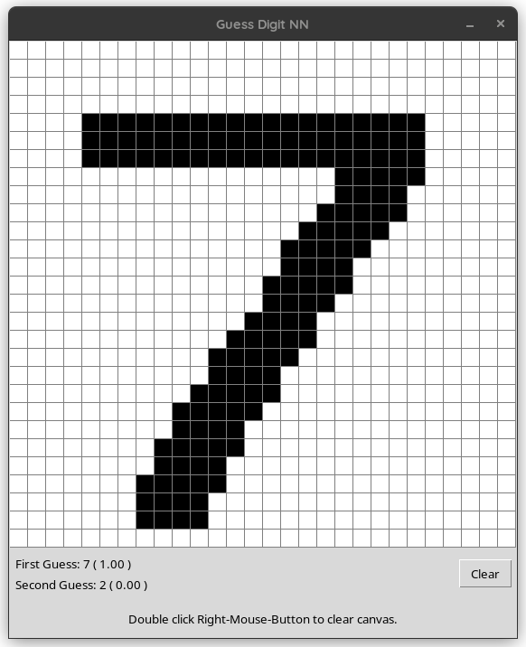

# Guess Digit NN

This is a basic app where you can draw a number on a canvas 
and ask the app to guess what number you have drawn. Under 
the hood, a pre-trained Convolutional Neural Network model 
gets the drawing, and tries to predict which number was drawn. 

## Dependencies 
Dependencies are listed in the `requirements.txt` file.

## Running the app (in linux)

Create a virtual environment and activate it.
then Run:

`pip install -r requirements.txt`

Once the requirements are installed, run: 

`python3 app.py`

## Controls: 

- Draw with mouse left button pressed
- Make a prediction by pressing space or Right-Mouse-Button
- Clear the canvas by double-clicking Right-Mouse-Button

